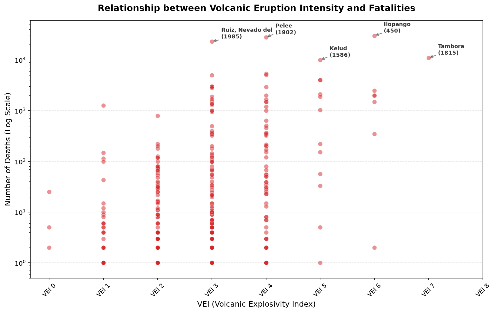

# The phenomenon

Volcanic eruptions are among the most destructive natural hazards on Earth, capable of killing thousands in a single event. However, the relationship between eruption size and human toll is far from straightforward. A massive VEI 7 explosion in an unpopulated region may claim zero lives, while a modest VEI 3 eruption at the foot of a dense city can be catastrophic. This project examines whether eruption intensity — measured by the Volcanic Explosivity Index (VEI) — is a reliable predictor of fatalities.



## The phenomenon

The scatter plot explores how the number of deaths varies across different VEI levels. The y-axis uses a logarithmic scale because death tolls span several orders of magnitude — from single digits to over ten thousand. The top five deadliest eruptions are annotated to highlight specific historical events.

## The source

The data comes from the NOAA NCEI Significant Volcanic Eruptions Database (https://www.ngdc.noaa.gov/hazel/view/hazards/volcano/event-data). The downloaded TSV file contains roughly 900 rows, each representing one significant volcanic eruption event. Key fields include the volcano name, country, latitude/longitude, VEI (0–8), eruption year, and death toll. The dataset covers events from 4360 BC to the present.

## What the picture shows

The plot reveals a wide spread of death tolls at every VEI level, with no strict upward trend. Notably, many of the deadliest eruptions fall in the VEI 3–5 range, suggesting that proximity to population centers matters more than raw explosive power. However, the chart hides eruptions with unknown or unrecorded death tolls — particularly older events — which could bias the apparent distribution toward recent, well-documented eruptions.


## Run it

```
uv run fetch.py
uv run plot.py
```
